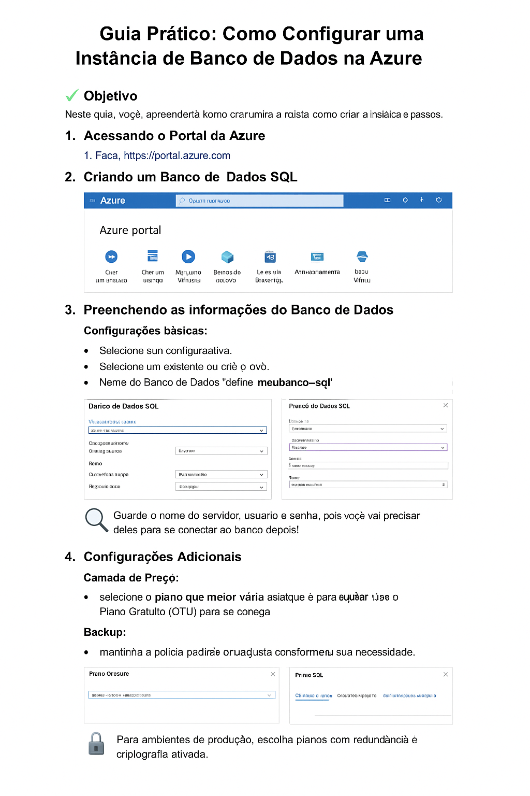

# Guia Prático: Como Configurar uma Instância de Banco de Dados na Azure

## 📄 Objetivo
Neste guia, você aprenderá como criar uma instância de banco de dados SQL no portal da Microsoft Azure, com imagens ilustrativas e dicas úteis.

---

## 1. Acessando o Portal da Azure

1. Acesse: [https://portal.azure.com](https://portal.azure.com)
2. Faça login com sua conta Microsoft.

---

## 2. Criando um Banco de Dados SQL

1. No menu lateral, clique em **"Criar um recurso"**.
2. Selecione **"Bancos de dados" > "Banco de Dados SQL"**.

---

## 3. Preenchendo as informações do Banco de Dados

### Configurações básicas:

- Selecione sua **assinatura ativa**
- Selecione um grupo de recursos ou crie um novo
- Defina o nome do banco, ex: `meubanco-sql`
- Crie um novo servidor:
  - Nome, região, nome de usuário e senha

> 🔍 **Dica:** Guarde nome do servidor, usuário e senha. Serão necessários para conectar depois!

---

## 4. Configurações Adicionais

### Camada de Preço:
- Selecione o **plano que melhor se adequa ao seu uso**
- Para testes, use o **Plano Gratuito (DTU)**

### Backup:
- Mantenha a política padrão ou ajuste conforme sua necessidade

> ⚡ Para ambientes de produção, escolha planos com **redundância e criptografia ativada**.

---

## 5. Revisar e Criar

1. Clique em **"Revisar + Criar"**
2. Verifique as configurações inseridas
3. Clique em **"Criar"** para iniciar a implantação

---

## 6. Conectando-se ao Banco de Dados

1. Após a implantação, acesse o recurso
2. Clique em **"Mostrar Cadeia de Conexão"**
3. Copie a string e use no SSMS ou em apps

> 🔐 **Dica:** Habilite o seu IP nas **regras de firewall** para conseguir acessar o banco.

---

## 📊 Conclusão

Seu banco de dados SQL está configurado na Azure! Agora você pode:

- Conectar aplicações
- Criar tabelas e consultas
- Gerenciar permissões e usuários
